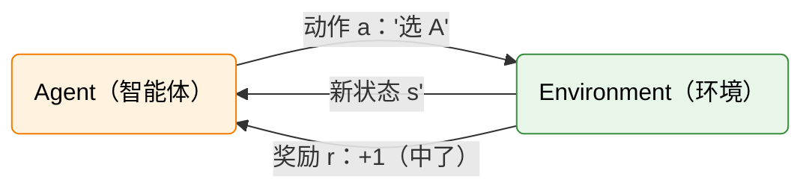

# 动手：两台老虎机——第一个 RL 决策

想象你走进一家赌场，面前只有两台老虎机。你有 100 枚硬币。你不知道哪台机器更容易中奖——唯一的方法是亲手去试。但每试一次，就少一枚硬币。**你是该继续尝试那台不确定的机器，还是锁定看起来不错的那台？**

这就是 RL 最经典的决策困境：**探索与利用（Exploration vs. Exploitation）**。它有一个学名叫"多臂老虎机问题"（Multi-Armed Bandit, MAB）。Thompson 早在 1933 年就从贝叶斯角度研究过这个问题 [^1]，Robbins 在 1952 年将其形式化为序贯决策问题 [^2]。但抛开学术史不谈，这个困境无处不在：选餐厅（老店还是新店）、看电影（熟悉的类型还是陌生的推荐）、甚至科研选题（深耕一个方向还是跨界尝试）。RL 做的事情，就是把这个日常决策变成了可以被精确分析和优化的问题。

前两章的实践已经隐含了这个困境。CartPole 训练时，智能体不能只会"一直往左推"——它得偶尔试试新动作，才可能发现更好的平衡策略；但也不能每一步都瞎试，否则杆子早就倒了，应该用已经验证有效的动作来稳住局面。DPO 训练时也类似：模型不能只生成安全但平庸的回答，需要偶尔尝试新的表达方式。但在那些实验中，这些机制被封装在算法内部。本章让我们亲手面对这个困境。

## 两台老虎机

你面前有两台老虎机。每台投 1 枚硬币，中奖吐出 2 枚（净赚 +1），不中奖吞掉（净亏 -1）。你有 100 次机会。你不知道两台机器的出奖概率。

这个设定看似简单，但它精确地描述了 RL 的核心矛盾：**前几轮你得两边都试试，才能搞清楚谁更好；但试出结果之后，你应该把剩余的硬币全投给那台更准的机器。** 试太多，浪费硬币在差机器上；试太少，可能永远不知道另一台其实更赚。

## 三种策略，三种结局

为使讨论更具体，我们设定一个前提：**A 台出奖率 60%，B 台出奖率 40%**。这一事实仅用于计算期望值，玩家在游戏中并不知晓，只能通过尝试来估计。

由此可以算出每台机器投一次的**期望收益**：

$$\mathbb{E}[R_A] = 0.6 \times (+1) + 0.4 \times (-1) = +0.2 \qquad \mathbb{E}[R_B] = 0.4 \times (+1) + 0.6 \times (-1) = -0.2$$

也就是说，A 台平均每次投币赚 0.2，B 台平均每次投币亏 0.2。后面所有策略的比较都基于这两个数字。以下比较三种典型策略在 100 轮内的表现。

### 策略 1：均匀随机

每轮以等概率随机选择一台，100 轮中约 50 次选 A、50 次选 B。期望总回报为

$$\mathbb{E}[R_{100}] = 50 \times 0.2 + 50 \times (-0.2) = 10 - 10 = 0$$

总回报在 0 附近波动。一半时间选 A（每次期望赚 0.2），一半时间选 B（每次期望亏 0.2），两者抵消。均匀随机策略完全不利用观测信息，因此无法从环境结构中获益。

### 策略 2：始终选 A（已知最优）

假设玩家已知 A 的出奖率更高，100 轮全部选择 A：

$$\mathbb{E}[R_{100}] = 100 \times \big(0.6 \times (+1) + 0.4 \times (-1)\big) = 100 \times 0.2 = 20$$

期望净赚 20。这是理论最优策略，但前提是已知哪台更好——在实际问题中这一信息必须通过尝试来获取。

### 策略 3：先试后定（Explore-then-Commit）

前 20 轮交替尝试 A 和 B，记录各自的胜率；后 80 轮始终选择观测胜率更高的那台。

分两段计算期望总回报。前 20 轮交替选 A 和 B，各 10 次：

$$\mathbb{E}[R_{\text{前20}}] = 10 \times 0.2 + 10 \times (-0.2) = 2 - 2 = 0$$

后 80 轮锁定 A（假设探索阶段正确识别了更优机器）：

$$\mathbb{E}[R_{\text{后80}}] = 80 \times 0.2 = 16$$

100 轮总期望回报为

$$\mathbb{E}[R_{100}] = 0 + 16 = 16$$

低于理论最优的 20——差额 4 就是探索成本。

### 真实场景：观测可能骗人

前面的计算做了一个乐观假设：探索阶段能**正确识别** A 更优。但在真实场景中，我们并不知道哪台机器更好——这正是需要探索的原因。那么问题来了：只有 10 次样本，估计真的可靠吗？

考虑一个具体的场景：A 的真实出奖率是 60%，但你选了 10 次 A，恰好只中了 4 次（观测出奖率 40%）。这完全可能——就像抛硬币 10 次，正面不一定刚好 5 次。同时 B 的真实出奖率只有 40%，但你选了 10 次 B，恰好中了 5 次（观测出奖率 50%）。此时你会判断 B 比 A 好，后 80 轮全部锁定在 B 上。

这种误判有多大概率发生？我们来算一下。A 投 10 次，每次中奖概率 60%，可能中 0 次、1 次……一直到 10 次。每种结果出现的概率由二项分布给出。例如，A 恰好中 4 次：

$$P(n_A = 4) = \binom{10}{4} \times 0.6^4 \times 0.4^6 \approx 11.1\%$$

同理，A 恰好中 3 次：$\binom{10}{3} \times 0.6^3 \times 0.4^7 \approx 4.2\%$；恰好中 5 次：$\binom{10}{5} \times 0.6^5 \times 0.4^5 \approx 20.1\%$。

B 投 10 次，每次中奖概率 40%，也可以列出所有结果的概率。误判的条件是 A 的中奖次数 $n_A$ 小于 B 的中奖次数 $n_B$，即 $(n_A, n_B)$ 的所有组合中满足 $n_A < n_B$ 的情况。把每种组合的概率相加：

$$P(n_A < n_B) = \sum_{n_A < n_B} P_A(n_A) \times P_B(n_B) \approx 18.5\%$$

大约每 5 次实验就有 1 次会误判。一旦误判，后 80 轮全部投给 B，期望总回报变为

$$\mathbb{E}[R_{100} \mid \text{误判}] = 0 + 80 \times (-0.2) = -16$$

策略 3 最终拿多少分，取决于你"运气好不好"：有 81.5% 的概率猜对了（拿 16 分），有 18.5% 的概率猜错了（亏 16 分）。期望回报就是把这两种结果按概率加权平均：

$$\mathbb{E}[R_{100}] = 81.5\% \times 16 + 18.5\% \times (-16) \approx 10.1$$

比不考虑误判的 16 低了将近 6 分。注意，这只是 A 和 B 差距较大的情况（60% vs 40%）。如果两台机器的差距更小，比如 52% vs 48%，误判概率会飙升到接近 50%——几乎等于抛硬币决定后 80 轮的命运。

这说明**探索阶段的样本量直接决定了最终回报**。样本太少，误判概率高，"先试后定"的优势会被严重削弱；样本太多，探索成本又吃掉了利润。如何在两者之间取得平衡，正是强化学习中探索策略设计的核心问题。

## 探索策略的对比

"先试后定"只是探索策略的一种。不同策略有不同的探索机制和代价：

| **策略** | **做法** | **探索机制** | **缺点** |
| --- | --- | --- | --- |
| 纯随机 | 均匀采样 | 无 | 永远学不到最优 |
| 贪心 | 永远选当前估计最优 | 无 | 可能锁定次优 |
| ε-贪婪 | 以 ε 概率随机，1-ε 选最优 | 固定比例探索 | ε 不随时间衰减 |
| 先试后定 | 前 N 步探索后利用 | 预算制 | N 不好选 |
| UCB | 选"估计均值 + 不确定性"最高的 | 不确定性驱动 | 需要维护置信区间 |
| Thompson Sampling | 从后验分布采样 | 概率匹配 | 需要贝叶斯更新 |

其中 UCB（Upper Confidence Bound [^3]）和 Thompson Sampling [^1] 是理论上最优的策略。如何衡量"最优"？学界使用一个叫 **Regret（遗憾值）** 的指标——本节末尾会简单介绍。

## 用 Python 搭建老虎机

```python
import random

class TwoArmedBandit:
    """两台老虎机：最简 RL 环境"""

    def __init__(self, prob_a=0.6, prob_b=0.4):
        self.prob_a = prob_a
        self.prob_b = prob_b

    def pull(self, arm):
        """拉某一台机器，返回奖励"""
        if arm == "A":
            return 1 if random.random() < self.prob_a else -1
        else:
            return 1 if random.random() < self.prob_b else -1
```

这个环境没有"状态"——不管你上一步选了哪台机器，这一步面对的情况一模一样。这就是老虎机的特点：它是一个**单状态 MDP**。后面我们会看到 CartPole 和 LLM 就不是这样了——它们的状态会随着动作而改变。

## 三种策略的 Python 实现

将上面的三种策略用代码实现，观察实际运行结果与理论期望的对比。以下代码均基于前面定义的 `TwoArmedBandit` 类，需先执行该类的定义代码。

### 策略 1：均匀随机

```python
from random import choice
env = TwoArmedBandit()
total = sum(env.pull(random.choice(["A", "B"])) for _ in range(100))
print(f"均匀随机 100 轮总回报: {total}，平均: {total/100:.2f}")
```

:::output
均匀随机 100 轮总回报: -2，平均: -0.02
:::

理论期望为 0，实际结果在 0 附近波动，符合预期。

### 策略 2：始终选 A（已知最优）

```python
env = TwoArmedBandit()
total = sum(env.pull("A") for _ in range(100))
print(f"始终选 A 100 轮总回报: {total}，平均: {total/100:.2f}")
```

:::output
始终选 A 100 轮总回报: 18，平均: 0.18
:::

理论期望为 20，实际 18——单次实验会有随机波动，但接近期望值。

### 策略 3：先试后定

```python
env = TwoArmedBandit()
rewards_a, rewards_b = [], []
total = 0
for i in range(100):
    if i < 20:
        arm = "A" if i % 2 == 0 else "B"
    else:
        avg_a = sum(rewards_a) / len(rewards_a) if rewards_a else 0
        avg_b = sum(rewards_b) / len(rewards_b) if rewards_b else 0
        arm = "A" if avg_a >= avg_b else "B"

    reward = env.pull(arm)
    total += reward
    (rewards_a if arm == "A" else rewards_b).append(reward)

print(f"先试后定 100 轮总回报: {total}，平均: {total/100:.2f}")
```

:::output
先试后定 100 轮总回报: 14，平均: 0.14
:::

理论期望为 16（不考虑误判），实际 14——低于"始终选 A"的 18，因为前 20 轮的探索没有产出收益。

### 结果对比

| 策略 | 理论期望 | 实际结果 | 说明 |
| --- | --- | --- | --- |
| 均匀随机 | 0 | −2 | 在 0 附近波动，不亏不赚 |
| 始终选 A | 20 | 18 | 接近期望，但需要事先知道 A 更好 |
| 先试后定 | 16 | 14 | 比始终选 A 少 4 分，差额来自探索成本 |

三种策略，同一组机器，结果差异显著。**策略决定了你能从环境中拿走多少价值。**

## 期望回报：衡量策略的标尺

期望回报 $\mathbb{E}[R]$ 把"策略好不好"从一个模糊的感觉变成了一个精确的数字：

| **策略** | **计算** | **期望回报** |
| --- | --- | --- |
| 随机 50/50 | 0.5 × 0.2 + 0.5 × (-0.2) | 0 |
| 永远选 A | 0.6 × 1 + 0.4 × (-1) | +0.2 |
| 永远选 B | 0.4 × 1 + 0.6 × (-1) | -0.2 |

期望回报越高，策略越好。这个数字不是某一次的运气，而是大量实验的平均趋势——就像掷骰子的期望值是 3.5，你永远掷不出 3.5，但大量实验的平均会趋近它。

一个重要洞察：同样是"永远选 A"，如果两台机器出奖率都是 50%，期望回报变成 0——和随机选没区别。**策略的好坏取决于环境有没有可以被利用的结构。** 如果环境是公平的，再聪明的策略也没用；如果环境有偏（A 比 B 好），好策略才能体现优势。RL 的本质，就是发现并利用环境的结构。

## Agent-Environment 交互循环

不管你是拉老虎机、控制 CartPole、还是训练大模型，RL 的交互模式都遵循同一个循环：



智能体选择动作，环境给出奖励和新状态，循环往复。在老虎机中，动作是"选 A 或选 B"，奖励是 ±1。在 CartPole 中，动作是"左推或右推"，状态是 4 个物理量，奖励是每步 +1。在 DPO 对齐大模型时，动作是"下一个 token"，奖励是"人类偏好打分"。表面上千差万别，底层是同一个循环。

第 2 章做 DPO 时，模型就是那个智能体。它选 token（动作），被偏好信号（奖励）引导，最终学会了"说什么更受欢迎"。你其实已经做过 RL 了——只不过当时被封装在 TRL 库的黑盒里。

## 从直觉到数学

这个简单的老虎机游戏已经暴露了 RL 的两个核心问题：

**策略的好坏取决于环境。** 好的策略需要"看懂"环境结构，然后选择能最大化收益的行动。

**期望回报可以量化策略好坏。** $\mathbb{E}[R]$ 把"策略好不好"从一个模糊的感觉变成了一个精确的数字。这是后续所有 RL 理论的基石。

但你可能会问：现在的期望回报只考虑了单步——拉一次，得一个奖励。真实的 RL 问题往往涉及多步决策：CartPole 要活 200 步，大模型要生成 500 个 token。多步的情况下，"长期的总收益"怎么定义？眼前的 1 分和 10 步后的 1 分一样值钱吗？策略本身又该怎么形式化地描述？

答案是：我们需要一套更强大的数学框架。这套框架不仅要能描述多步决策，还要能处理"状态会随动作而改变"的复杂情况——这正是老虎机做不到的（它的状态永远不变）。下一节将把"状态、动作、奖励"这些直观概念提炼成精确的数学框架。[MDP 五元组、折扣回报与策略](./mdp)

## 延伸：Regret——衡量探索策略的通用标尺

前面我们用期望回报比较了三种策略。但期望回报依赖于具体的老虎机参数（A 台 60%、B 台 40%），换一组参数数字就全变了。学界需要一个**通用的评价指标**：不管几台机器、不管出奖率是多少，都能用同一个标准衡量"这个策略有多好"。这个标准就是 **Regret（遗憾值）**。

Regret 的定义很直觉：假设你从一开始就知道哪台机器最优，100 轮全选它，能拿满分。但你不知道，所以用了某个策略，实际拿的分比满分少。少拿的部分就是 Regret：

> Regret = 最优策略的回报 − 你的策略的回报

用我们的老虎机算一笔账（最优策略 100 轮全选 A，总期望 20 分）：

| 策略 | 实际总期望 | Regret |
| --- | --- | --- |
| 均匀随机 | 0 分 | 20 − 0 = **20** |
| 始终选 A | 20 分 | 20 − 20 = **0** |
| 先试后定 | 16 分 | 20 − 16 = **4** |

Regret 越小，策略越好。均匀随机每 100 轮"白亏" 20 分，先试后定只亏 4 分，始终选 A 不亏——但前提是你得一开始就知道 A 更好，现实中不可能。

**RL 的目标，就是设计出 Regret 增长尽可能慢的策略。** 前面提到的 UCB 和 Thompson Sampling，正是学界在这条路上找到的最优解——它们的 Regret 随时间以对数速率增长，达到了理论下界 [^4]。感兴趣的同学可以进一步阅读参考文献。

## 参考文献

[^1]: Thompson, W. R. (1933). On the likelihood that one unknown probability exceeds another in view of the evidence of two samples. _Biometrika_, 25(3/4), 285-294.

[^2]: Robbins, H. (1952). Some aspects of the sequential design of experiments. _Bulletin of the American Mathematical Society_, 58(5), 527-535.

[^3]: Auer, P., Cesa-Bianchi, N., & Fischer, P. (2002). Finite-time analysis of the multiarmed bandit problem. _Machine Learning_, 47(2-3), 235-256.

[^4]: Lai, T. L., & Robbins, H. (1985). Asymptotically efficient adaptive allocation rules. _Advances in Applied Mathematics_, 6(1), 4-22.
