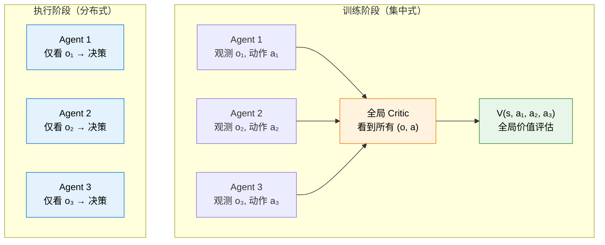
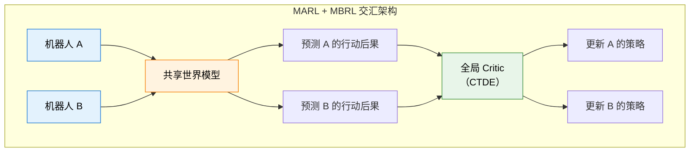

# 13.3 多智能体 RL 与基于模型的 RL

前两节我们讨论了测试时计算和具身智能。现在我们来聊 RL 的两个重要延伸方向。它们看似毫不相关，但有一个共同的主题：**突破单智能体、无模型 RL 的限制**。多智能体 RL（MARL）突破了"单智能体"的限制——从单兵作战走向团队协作。基于模型的 RL（MBRL）突破了"无模型"的限制——从盲目试错走向"在脑内推演"。

## 多智能体 RL：从单兵到团队

到目前为止，我们所有的 RL 智能体都是独自面对环境的。第 9 章的 Agent 虽然可以调用工具，但决策的核心始终是一个模型。但在很多场景中，任务需要**多个智能体协作**完成。

想象一个软件开发团队：Coder 负责写代码，Reviewer 负责审查代码质量，Tester 负责测试功能完整性。三个角色需要紧密配合——Coder 写完代码后，Reviewer 发现了一个潜在的 bug，Tester 根据这个反馈设计了针对性的测试用例。这种协作的效率远超任何单一角色。

但训练多个智能体协作比训练单个智能体难得多。为什么？因为当你在学习新策略时，你的队友也在学习——你面对的"环境"在不断变化。这打破了单智能体 RL 的基本假设。

### MARL 的核心痛点

**非平稳性（Non-stationarity）**。在单智能体 RL 中，环境是固定的——CartPole 的物理规律不会因为你训练了一万步就变了。但在多智能体环境中，其他智能体也在学习。当你适应了对手的策略时，对手已经变了。这就像在打一个规则不断变化的游戏。

**信用分配（Credit Assignment）**。在多智能体合作中，团队成功了——功劳归谁？团队失败了——责任在谁？这比第 9 章的"多轮信用分配"更难，因为现在是多个独立的决策者在同时行动，你很难说"这一步的成功是因为 Coder 写得好，还是因为 Reviewer 提醒得及时"。

### CTDE：集中训练，分布执行

CTDE（Centralized Training, Decentralized Execution）是当前 MARL 的主流范式，也是解决非平稳性的关键方案：

- **训练时**：有一个"上帝视角"的全局 Critic，可以看到所有智能体的观测和动作。这个全局 Critic 能准确评估每个智能体的贡献，因为它知道"全貌"。
- **执行时**：每个智能体只能根据自己的局部观测做决策。这符合现实约束——自动驾驶汽车不可能知道其他车辆的内部状态，只能根据自己看到的路况做决策。



### MARL 核心算法谱系

| 算法       | 核心思路                           | 适用场景                | 与单智能体算法的联系       |
| ---------- | ---------------------------------- | ----------------------- | -------------------------- |
| **IPPO**   | 每个智能体独立运行 PPO，互不通信   | 基线方法，角色相同      | 直接复用第 6 章 PPO        |
| **MAPPO**  | PPO + 全局价值函数（CTDE）         | 需要协作的团队任务      | PPO + 全局 Critic          |
| **QMIX**   | 混合网络保证局部 Q 值与全局 Q 单调 | 合作型任务              | 第 4 章 DQN 的多智能体扩展 |
| **MADDPG** | 每个智能体用 DDPG + 全局 Critic    | 连续动作，混合合作/竞争 | DDPG 的多智能体扩展        |

IPPO 是最简单的起步方案——每个智能体假装其他智能体是环境的一部分，独立运行 PPO。这在智能体角色相同（如多辆出租车协同调度）的场景中效果不错。MAPPO 是 IPPO 的进阶版——训练时利用全局信息来稳定 Critic 的训练，执行时每个智能体独立决策。你可以把 MAPPO 理解为"训练时有上帝帮忙，执行时各自为战"。

### 一个具体的 MARL 场景

让我们用一个具体的例子来感受 MARL 的挑战和 CTDE 的威力。假设我们要训练一个 AI 软件开发团队：

```python
# 多智能体角色定义
class DevTeam:
    """AI 软件开发团队：三个智能体协作完成项目"""

    def __init__(self):
        self.coder = Agent(role="coder")      # 写代码
        self.reviewer = Agent(role="reviewer") # 审查代码
        self.tester = Agent(role="tester")     # 测试功能

    def ctde_train_step(self, task):
        """一步 CTDE 训练"""
        # --- 执行阶段：每个智能体只看自己的局部观测 ---
        code = self.coder.act(observation=task.spec)         # coder 看需求文档
        review = self.reviewer.act(observation=code)          # reviewer 看代码
        test_plan = self.tester.act(observation=code, review) # tester 看代码和审查

        # --- 训练阶段：全局 Critic 看到所有人的动作 ---
        global_state = {
            "code": code, "review": review, "test_plan": test_plan
        }
        # 全局 Critic 评估每个智能体的贡献
        q_values = global_critic(global_state)
        # 用 Q 值来更新各个智能体的策略
        return q_values
```

这个例子展示了 CTDE 的核心思想：执行时每个智能体只看自己的输入（Coder 看需求、Reviewer 看代码、Tester 看代码和审查），训练时全局 Critic 看到所有人的动作和结果来评估各自的贡献。这解决了信用分配问题——全局 Critic 知道"最终代码的 bug 是因为 Coder 写错了，还是因为 Reviewer 漏检了"。

## 基于模型的 RL：在脑内推演

前面所有章节覆盖的都是 **Model-Free RL**——智能体不知道环境内部如何运作，只能通过不断试错来积累经验。Q-Learning、DQN、PPO、DPO、GRPO，全都是 Model-Free 的。

但还有另一条路线：**Model-Based RL（MBRL）先学习一个"世界模型"，然后在这个虚拟世界中"想象"和"规划"**。

### Model-Free vs Model-Based

|                  | Model-Free（本书主线）   | Model-Based                      |
| ---------------- | ------------------------ | -------------------------------- |
| 是否需要环境模型 | 不需要                   | 需要先学一个世界模型             |
| 样本效率         | 低（需要大量试错）       | 高（可以在脑内"想象"无数次）     |
| 策略质量         | 通常更高（直接优化策略） | 可能次优（受限于世界模型的精度） |
| 代表算法         | DQN、PPO、DPO、GRPO      | Dreamer、MuZero、AlphaZero       |
| 类比             | 靠经验学开车             | 先学物理规律，再推演怎么开       |
| 适用场景         | 有大量交互数据           | 交互成本高（如机器人）           |

MBRL 的核心思想可以用一个简单的公式来表达。在 Model-Free RL 中，策略优化的数据全部来自真实环境：

$$\theta \leftarrow \theta + \alpha \nabla_\theta J(\theta) \quad \text{数据来自真实环境}$$

在 Model-Based RL 中，策略优化的数据大部分来自世界模型：

$$\theta \leftarrow \theta + \alpha \nabla_\theta J(\theta) \quad \text{数据来自世界模型的"想象"}$$

世界模型 $\hat{P}(s_{t+1}|s_t, a_t)$ 学会了预测"在状态 $s_t$ 下做动作 $a_t$，环境会变成什么样"。有了这个模型，智能体可以在脑内模拟无数次交互，生成海量的训练数据，而真实环境只需要提供少量数据来训练世界模型本身。

### 代表性工作

**MuZero**。AlphaGo 的继任者。AlphaGo 需要人类告诉它围棋规则（状态转移），但 MuZero 完全从零开始——自己学会环境的动态规律，然后在脑内用 MCTS 规划。MuZero 不仅学会了围棋、国际象棋、将棋，还学会了 Atari 游戏——全部从零开始，不需要任何先验知识。

**Dreamer 系列**。Dreamer 在潜空间（Latent Space）中构建世界模型。它把高维的观测（比如游戏画面）压缩到一个低维的隐空间，在隐空间中学习环境的动态规律，然后在隐空间中做规划和策略优化。Dreamer 的样本效率比 Model-Free 方法高一个数量级——同样的任务，Dreamer 需要的交互量只有 Model-Free 方法的十分之一。

**AlphaZero**。AlphaZero 用 MCTS（蒙特卡洛树搜索）在脑内推演。每走一步棋之前，AlphaZero 先在脑内模拟几万次对局，评估每一步棋的胜率，然后选择胜率最高的。这个"在脑内搜索"的能力让 AlphaZero 远超所有人类棋手。我们在第 5 章的 AlphaGo 简单复现中已经接触过 MCTS 的基本思想。

### 为什么 MBRL 对大模型领域也很重要？

你可能觉得 MBRL 和大模型没什么关系——毕竟大模型的训练数据是互联网文本，不需要"学习环境模型"。但其实，**大语言模型本身就是一个关于语言的世界模型**。

当你要求大模型用思维链（CoT）进行多步推理时，它其实就是在做某种形式的"内部规划"：先推理出第一步的结论，再基于这个结论推理第二步，以此类推。这和 MBRL 中"在世界模型中规划"的思路非常相似。

$$\text{CoT 推理} \approx \text{在世界模型中规划}$$

更具体地说：

- **世界模型** = 大模型的语言建模能力（预测下一个 token）
- **规划** = 思维链的多步推理
- **动作** = 选择推理的路径（验证、回溯、尝试新方向）
- **Reward** = 最终答案的正确性

这也是为什么第 8 章的 GRPO 和本章的 DeepSeek-R1 能通过 RL 激发出推理能力——大模型本身就是一个强大的世界模型，RL 教会了它如何更好地利用这个世界模型来规划推理路径。

<details>
<summary>数学补充：MBRL 的策略优化目标</summary>

在 Model-Free RL 中，策略优化的目标是：

$$J(\theta) = \mathbb{E}_{\pi_\theta}\left[\sum_{t=0}^{T} \gamma^t r(s_t, a_t)\right]$$

数据 $(s_t, a_t, r_t, s_{t+1})$ 全部来自真实环境。

在 Model-Based RL 中，策略优化的目标形式相同，但数据来自世界模型 $\hat{P}$：

$$J(\theta) = \mathbb{E}_{\pi_\theta, \hat{P}}\left[\sum_{t=0}^{T} \gamma^t r(\hat{s}_t, a_t)\right]$$

其中 $\hat{s}_{t+1} \sim \hat{P}(\hat{s}_{t+1}|\hat{s}_t, a_t)$ 是世界模型预测的下一个状态。关键区别在于：用 $\hat{P}$ 生成数据几乎零成本（只是前向传播），所以可以做无数次"想象"。

但 MBRL 有一个根本性的风险：如果世界模型 $\hat{P}$ 不够准确，策略可能在一个"错误的虚拟世界"中被过度优化，迁移到真实环境时表现很差。这叫**模型偏差（Model Bias）**——你学得越认真，错得越离谱。

</details>

<details>
<summary>思考题：大模型的 CoT 推理和 MBRL 的规划有什么相似之处？又有什么本质区别？</summary>

**相似之处**：都是利用内部模型（大模型的语言能力 / 学到的世界模型）来推演未来，选择最优的行动路径。都不需要在真实环境中真正执行所有可能的行动。

**本质区别**：MBRL 的世界模型是显式训练的——它专门学了一个 $\hat{P}(s'|s,a)$ 来预测环境动态。大模型的 CoT 推理没有显式的"世界模型"——它的推理能力是语言建模能力的副产品。这意味着大模型的"世界模型"更灵活（可以处理任何文本描述的场景），但也更不精确（没有经过专门的环境预测训练）。

第 10 章 VLM 的 RL 训练试图弥合这个差距——通过 RL 训练视觉语言模型更准确地在视觉场景中推理和规划。

</details>

## MARL + MBRL：两条路线的交汇

MARL 和 MBRL 看似是两个独立的方向，但它们正在一些前沿工作中交汇。一个典型的场景是**多机器人协作**：多个机器人需要协作完成一个任务（比如搬运重物），同时每个机器人的策略需要基于一个世界模型来做规划（预测"如果我推这边，物体会怎么动？其他机器人会怎么反应？"）。

这把前面讨论的所有难题叠加在了一起：多智能体的非平稳性 + 世界模型的模型偏差 + 物理世界的安全约束。目前这个方向还在早期探索阶段，但被认为是通往通用具身智能的必经之路。



<details>
<summary>思考题：CTDE 中的全局 Critic 和 MBRL 中的世界模型有什么联系？</summary>

全局 Critic 和世界模型都在做"预测"——但预测的对象不同。全局 Critic 预测的是"给定所有智能体的当前状态和动作，期望的总回报是多少"——它在预测**价值**。世界模型预测的是"给定当前状态和动作，环境会变成什么样"——它在预测**状态**。

它们的联系在于：如果你有一个准确的世界模型，你可以在"想象中"展开多条可能的轨迹，然后用这些轨迹来训练全局 Critic。这和 MBRL 的"在脑内想象"思路一致——只不过现在想象的是多个智能体交互的复杂场景。这种"世界模型辅助的 MARL"是当前研究的前沿方向之一。

</details>

MARL 和 MBRL 是 RL 的两个重要延伸，分别解决了"协作"和"效率"的核心问题。下一节我们讨论一个更"自我"的方向——[自博弈、自进化与学习路线](./self-play-outlook)，看看模型能否通过和自己的博弈来持续进化。之后我们还会讨论另一个重要范式——[离线强化学习](./offline-rl)：当不能在线交互时，如何从历史数据中学习策略。
