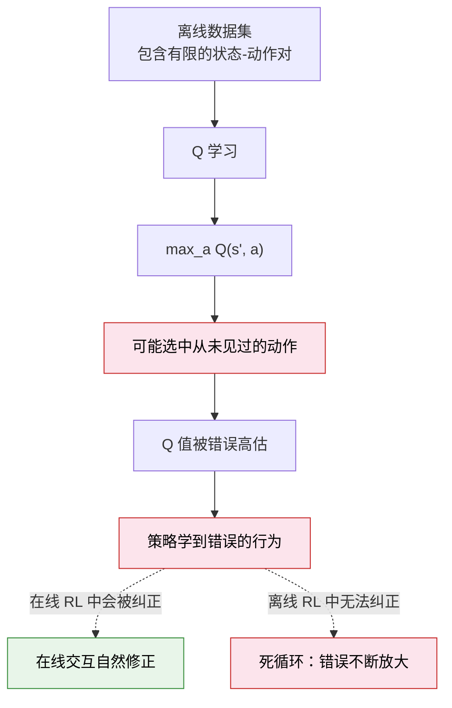

# 13.5 离线强化学习：只看录像学开车

到目前为止，我们接触的所有 RL 算法（DQN、PPO、SAC、GRPO）都有一个共同的前提假设：**智能体可以在环境中自由交互**。CartPole 想玩多少局就玩多少局，Atari 游戏随时可以重来，LLM 的回答可以在线生成并评分。

但真实世界的很多场景**不允许自由试错**。你想让自动驾驶学会处理十字路口的紧急情况，不可能让它在真实路口不断试撞。你想让医疗 AI 学会个性化治疗方案，不可能拿病人做随机实验。你想让机器人在工厂里学会新任务，每一次试错都可能损坏设备。

这些场景有一个共同特点：你有**大量历史数据**（行车记录、病历、操作日志），但**不能在线交互**。这就是离线强化学习（Offline RL）要解决的问题。

## 什么是在线、离线、离线到在线？

先理清三种学习范式的区别：

| 范式                               | 数据来源                 | 能否交互 | 代表方法                       |
| ---------------------------------- | ------------------------ | -------- | ------------------------------ |
| **在线 RL (Online RL)**            | 实时交互产生             | 能       | DQN, PPO, SAC                  |
| **离线 RL (Offline RL)**           | 固定的历史数据集         | **不能** | CQL, IQL, Decision Transformer |
| **离线到在线 (Offline-to-Online)** | 先用历史数据，再在线微调 | 后期可以 | 离线预训练 + 在线微调          |

用一个类比来理解：

- **在线 RL** = 边开车边学，教练在旁边随时反馈
- **离线 RL** = 只看大量行车录像，从录像中学习怎么开车
- **离线到在线** = 先看录像学会基本操作，再实际上路练习

第 8 章的 DPO 其实就是一种离线 RL——它只用固定的偏好数据集训练，不在线生成新数据。但 DPO 是专为 LLM 对齐设计的。传统离线 RL 要解决的是更通用的问题：从任意的交互数据中学习策略。

## 离线 RL 的根本挑战：分布外动作

离线 RL 最大的敌人是**分布外动作（Out-of-Distribution Actions, OOD）**。

在线 RL 中，智能体可以尝试任何动作，如果某个动作效果不好，Q 值会自然降低。但离线 RL 中，你只有数据集中记录的那些 $(s, a, r, s')$ 转移。当 Q 学习更新时，它需要用 $\max_{a'} Q(s', a')$ 来估计未来价值——但这个 $\max$ 可能选到数据集中从未出现过的动作。

问题在于：**Q 函数对从未见过的 $(s, a)$ 组合的估计是不可靠的。** 它可能会错误地认为某个从未尝试过的动作有极高的 Q 值——因为没有人做过这个动作，所以没有负面的经验来纠正这个错误。



这是离线 RL 的核心矛盾：Q 学习需要估计所有动作的价值，但数据集只覆盖了部分动作。那些"未覆盖"的动作就像盲区——你看不见，Q 函数却可能在那里面找到虚假的高分。

## 三大代表方法

### CQL：保守 Q 学习

CQL（Conservative Q-Learning）[^1] 的思路最直接：**既然 Q 值会被高估，那就主动把 Q 值压低。**

标准 Q 学习只最小化 TD Error：

$$\mathcal{L}_{TD} = \mathbb{E}_{(s,a) \sim \mathcal{D}} \Big[ \big( Q(s, a) - r - \gamma \max_{a'} Q(s', a') \big)^2 \Big]$$

CQL 在此基础上加了一个**保守正则项**：

$$\mathcal{L}_{CQL} = \mathcal{L}_{TD} + \alpha \underbrace{\Big( \mathbb{E}_{s \sim \mathcal{D}, a \sim \pi(\cdot|s)} [Q(s, a)] - \mathbb{E}_{s, a \sim \mathcal{D}} [Q(s, a)] \Big)}_{\text{压低策略动作的 Q 值，抬高数据集动作的 Q 值}}$$

直觉上：对数据集中出现过的 $(s, a)$，CQL 鼓励 Q 值偏高（因为这些是"安全"的）；对策略新选择的动作（可能 OOD），CQL 惩罚 Q 值偏高。这样策略就不会被虚假的高 Q 值欺骗。

### IQL：隐式 Q 学习

IQL（Implicit Q-Learning）[^2] 用一种更巧妙的方式回避了 OOD 问题：**完全不评估数据集之外的动作。**

标准 Q 学习需要用 $\max_{a'} Q(s', a')$ 遍历所有动作——这正是 OOD 问题的根源。IQL 的思路是：我不直接在动作上取 max，而是用**期望回归（Expectile Regression）**来间接估计 $\max$：

$$\mathcal{L}_{IQL} = \mathbb{E}_{(s,a) \sim \mathcal{D}} \Big[ L_\tau^2 \big( Q(s, a) - V(s) \big) \Big]$$

其中 $L_\tau^2$ 是非对称的平方损失，$\tau$ 通常取 0.7-0.9。这个损失函数的特点是：当 $Q > V$ 时（某个动作比平均水平好），惩罚很小；当 $Q < V$ 时，惩罚很大。这等价于在**只使用数据集中的动作**的前提下，估计一个"近似最大值"。

IQL 的最大优势是简洁：不需要在动作空间做 $\arg\max$，不需要行为策略的显式模型，训练稳定。

### Decision Transformer：把 RL 当序列建模

Decision Transformer（DT）[^3] 完全抛弃了 Q 学习的框架，把 RL 问题转化为一个**序列预测问题**。

核心思路：把一段 RL 轨迹表示为一个 token 序列，然后用 Transformer 来预测"给定回报目标，应该输出什么动作"：

$$\text{输入序列}: [\hat{R}_1, s_1, a_1, \hat{R}_2, s_2, a_2, \ldots]$$

其中 $\hat{R}_t = \sum_{t'=t}^T r_{t'}$ 是从时刻 $t$ 到结束的累积回报。Transformer 学会了：**给定"我想拿到这么多回报"的目标，在这个状态下应该做什么动作。**

```python
# ==========================================
# Decision Transformer 的核心思想（伪代码）
# ==========================================
class DecisionTransformer(nn.Module):
    """
    把 RL 轨迹当成语言序列来建模
    输入：[回报目标, 状态, 动作, 回报目标, 状态, 动作, ...]
    输出：预测每一步的动作
    """

    def __init__(self, state_dim, action_dim, seq_len=20):
        super().__init__()
        # 三个 embedding 层
        self.return_embed = nn.Linear(1, 128)   # 回报 → embedding
        self.state_embed = nn.Linear(state_dim, 128)  # 状态 → embedding
        self.action_embed = nn.Linear(action_dim, 128) # 动作 → embedding

        # 标准 Transformer（和 GPT 一样）
        self.transformer = nn.TransformerEncoder(
            nn.TransformerEncoderLayer(d_model=128, nhead=4),
            num_layers=3
        )

        # 输出头：给定序列，预测动作
        self.action_head = nn.Linear(128, action_dim)

    def forward(self, returns, states, actions):
        # 把回报、状态、动作拼接成序列
        seq = []
        for t in range(len(returns)):
            seq.append(self.return_embed(returns[t]))
            seq.append(self.state_embed(states[t]))
            seq.append(self.action_embed(actions[t]))

        # Transformer 处理序列
        hidden = self.transformer(torch.stack(seq))

        # 预测每一步的动作
        # 只取对应"状态位置"的输出（因为动作紧跟在状态后面）
        predicted_actions = self.action_head(hidden[1::3])  # 每3个取第2个
        return predicted_actions

# 推理时：告诉模型"我要拿高分"，它就会输出高分轨迹对应的动作
target_return = torch.tensor([360.0])  # "我想拿到 360 分"
action = model.predict(target_return, current_state)
```

DT 的推理方式非常有趣：你设定一个**回报目标**，模型就生成能达到这个目标的动作。想要更好的表现？把目标设高一点。这和第 8 章 GRPO 的"可验证奖励"有相似之处——都是用明确的目标来引导行为，但 DT 是离线的、基于序列建模的。

## 三种方法对比

| 维度            | CQL              | IQL                 | Decision Transformer |
| --------------- | ---------------- | ------------------- | -------------------- |
| 核心思路        | 保守估计 Q 值    | 回避 OOD 动作       | 把 RL 当序列建模     |
| 是否需要 Q 函数 | 是（带保守正则） | 是（但不取 argmax） | 否（直接预测动作）   |
| 架构            | 标准 Q 网络      | Q 网络 + V 网络     | Transformer          |
| 数据效率        | 中等             | 高                  | 中等                 |
| 训练稳定性      | 需要调 $\alpha$  | 较稳定              | 较稳定               |
| 适用场景        | 通用离线 RL      | 数据质量较差时      | 长序列决策、多任务   |

## 与 DPO 的联系：你已经在用离线 RL 了

回顾第 8 章的 DPO：它只用固定的偏好数据集 $(x, y_w, y_l)$ 训练，不需要在线生成和评分。从离线 RL 的视角看，DPO 就是一种特殊的离线 RL 方法——只不过它的"奖励"不是来自环境，而是来自人类的偏好标注。

| 离线 RL 方法         | 数据类型               | 奖励来源             | 应用场景           |
| -------------------- | ---------------------- | -------------------- | ------------------ |
| CQL / IQL            | $(s, a, r, s')$ 转移   | 环境奖励             | 机器人、游戏、推荐 |
| Decision Transformer | 完整轨迹 + 回报        | 轨迹回报             | 多任务、序列决策   |
| DPO（第 8 章）       | 偏好对 $(x, y_w, y_l)$ | 隐式奖励（人类偏好） | LLM 对齐           |
| GRPO（第 8 章）      | 在线生成 + 规则奖励    | 可验证奖励           | LLM 推理           |

理解了这个联系，你会发现 DPO 和 CQL 解决的是同一个问题——**如何在不需要在线交互的情况下，从有限的数据中学到好的策略**——只是应用场景和方法不同。

## 离线 RL 的未来：与 LLM 后训练的融合

2025 年，离线 RL 和 LLM 后训练的融合成为了一个热门方向。一个值得关注的趋势是：

1. **离线预训练 + 在线微调**：先用离线 RL 从大量历史数据中学一个合理的初始策略，再用 GRPO/DAPO 在线微调。这和 LLM 的"预训练 + RL"范式完全一致。
2. **Decision Transformer + LLM**：用 LLM 作为 Decision Transformer 的骨干网络，利用 LLM 的世界知识来辅助决策。
3. **奖励加权微调**：NeurIPS 2025 的工作将离线 RL 重新表述为"奖励加权微调"，直接在 LLM 的微调框架中实现离线 RL，无需额外的 RL 基础设施。

这些方向表明，离线 RL 不只是传统 RL 的一个子领域——它是连接传统 RL 和 LLM 后训练的桥梁。

<details>
<summary>思考题：为什么 DPO 不需要解决"分布外动作"问题，而 CQL 需要？</summary>

因为 DPO 和 CQL 处理的"动作空间"性质完全不同。

CQL 面对的是通用 RL 环境（比如机器人控制），动作空间是连续的、高维的。数据集中只覆盖了极小一部分 $(s, a)$ 组合，大部分动作从未被尝试过。Q 函数必须在这些"未见过"的动作上做评估，所以 OOD 问题不可避免。

DPO 面对的是 LLM 的 token 空间。虽然 token 组合也是天文数字，但 DPO 的训练方式不同——它不是学习一个覆盖所有 $(x, y)$ 的 Q 函数，而是学习一个**相对偏好**：给定 $x$，$y_w$ 比 $y_l$ 好多少。这个相对偏好是通过 Bradley-Terry 模型推导出来的，天然避开了"未见过动作的绝对价值"问题。另外，DPO 的参考模型（Reference Model）起到了类似 CQL 保守正则项的作用——它约束微调后的模型不要偏离太远，防止了策略崩溃。

</details>

---

**参考文献**：

[^1]: Kumar, A. et al. (2020). Conservative Q-Learning for Offline Reinforcement Learning. _NeurIPS_.

[^2]: Kostrikov, I. et al. (2022). Offline Reinforcement Learning with Implicit Q-Learning. _ICLR_.

[^3]: Chen, L. et al. (2021). Decision Transformer: Reinforcement Learning via Sequence Modeling. _NeurIPS_.

本章的最后，让我们用 PettingZoo 来做一个多智能体 RL 的动手实验——[动手：PettingZoo 多智能体](./pettingzoo)。
