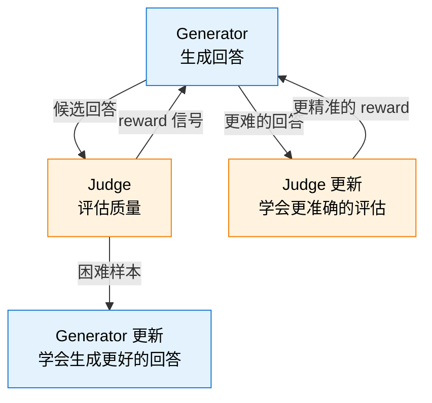

# 13.4 自博弈、自进化与学习路线

AlphaGo 通过自我博弈从零开始学会了下围棋——不需要人类棋谱，不需要专家演示，只需要一个棋盘和自我对弈的循环。这个"从零到超人"的故事是 RL 最具传奇色彩的篇章之一。2025-2026 年，同样的思路正在被迁移到大语言模型：**模型能否通过和自己的博弈来持续进化，最终突破人类数据的上限？**

这一节我们来拆解自博弈和自进化的核心思路，讨论它面临的挑战，最后为整本书画上一个句号——提供一条从本书出发的持续学习路线。

## 自博弈 RL：模型 vs 模型

自博弈（Self-Play）的核心思想极其优雅：**不依赖外部数据，让模型自己生成训练数据**。具体的流程是：

1. 模型生成多个候选回答（或动作）
2. 另一个模型实例（或同一个模型）评估这些回答的质量
3. 用评估结果作为 reward 信号更新模型
4. 重复

这和第 8 章 GRPO 的"组内比较"有异曲同工之处。GRPO 让同一个模型生成多条回答，然后在组内比较它们的优劣。自博弈把这个思路进一步推远——不只是"组内比较"，而是让模型扮演不同的角色，通过博弈来共同提升。

### Generator-Judge 对抗训练

这是自博弈在大模型领域最常见的形态。一个模型扮演 **Generator**（生成回答），另一个模型扮演 **Judge**（评估回答质量）。两者通过对抗训练共同提升：



Generator 试图生成"让 Judge 给高分"的回答，Judge 试图"更准确地评估回答质量"。这和生成对抗网络（GAN）的思想非常相似——Generator 和 Discriminator 通过对抗共同提升。区别在于，GAN 的 Discriminator 区分"真实数据"和"生成数据"，而自博弈的 Judge 评估的是"回答质量"。

### 辩论式训练

辩论式训练（Debate Training）是自博弈的一个更有趣的变体。两个模型对同一个问题给出**不同**的回答，然后由一个裁判模型判断哪个回答更好。关键在于：两个模型可以看到对方的回答并进行反驳。

这个过程迫使模型学会**严谨推理**——如果你的推理有漏洞，对手会抓住它。如果对手的推理有漏洞，你需要指出它。这种"辩论-裁判"的机制让模型在对抗中学会了更严谨的推理策略。

```python
def debate_training(question, model_a, model_b, judge, rounds=3):
    """辩论式训练：两个模型辩论，裁判评判"""
    answer_a = model_a.generate(question)
    answer_b = model_b.generate(question)

    for round_idx in range(rounds):
        # A 看到B的回答，进行反驳
        rebuttal_a = model_a.generate(
            f"问题: {question}\n你的回答: {answer_a}\n"
            f"对手回答: {answer_b}\n请反驳对手。"
        )
        # B 看到A的反驳，进行回应
        rebuttal_b = model_b.generate(
            f"问题: {question}\n你的回答: {answer_b}\n"
            f"对手反驳: {rebuttal_a}\n请回应。"
        )
        answer_a = rebuttal_a
        answer_b = rebuttal_b

    # 裁判评判胜负
    winner = judge.evaluate(question, answer_a, answer_b)
    # winner 作为 reward 信号更新两个模型
    return winner
```

## Online Learning：不停止的学习循环

传统的 RLHF 是"离线"的：收集一批偏好数据 -> 训练 Reward Model -> 用 RM 指导策略优化 -> 部署。整个过程像一个瀑布——一次做完，不能回头。

Online Learning 把这个过程变成了一个**持续的循环**：

$$\text{当前策略 } \pi_\theta \xrightarrow{\text{交互}} \text{新经验} \xrightarrow{\text{更新}} \text{新策略 } \pi_{\theta'} \xrightarrow{\text{交互}} \cdots$$

关键区别在于：模型可以**探索自己当前策略空间中发现的新现象**。在离线 RLHF 中，训练数据是固定的——模型只能在人类已经看过的回答类型中学习。在 Online Learning 中，模型可以探索全新的回答方式，发现人类从未想到的解题策略。

DeepSeek-R1 的"涌现推理能力"某种程度上就是 Online Learning 的效果——模型通过持续探索，发现了自我验证、回溯等人类没有教过它的推理策略。

## 自进化系统：模型自我提升的三个维度

综合自博弈和 Online Learning，我们可以构想一个**自进化系统**——模型通过三个维度持续自我提升：

### 维度一：经验回放与提炼

模型将成功的推理路径总结为"经验"，存入外部记忆。当遇到类似问题时，先检索相关的成功经验作为参考。这和第 4 章 DQN 的经验回放有相似之处——都是"复用过去的经验"。区别在于 DQN 是原样复用，而自进化系统会"提炼"经验——把成功的推理路径压缩成可复用的模式。

### 维度二：失败驱动的课程生成

模型自动找出自己做不好的任务类型，集中生成更多这类训练数据。这就像一个学生发现自己数学的"概率题"总是做错，就专门找更多概率题来练习——一种自动化的课程学习（Curriculum Learning）。

### 维度三：自我反思与回溯

在推理过程中检测到错误信号时，自动回溯并尝试新路径。这就是 DeepSeek-R1 展示的"顿悟"——模型在推理中发现自己可能走错了方向，主动退回尝试新的推理路径。

## 自进化的挑战

自进化系统听起来很美好，但目前仍面临几个根本性挑战：

| 挑战       | 描述                                 | 可能的缓解方案                  |
| ---------- | ------------------------------------ | ------------------------------- |
| 自循环退化 | 模型的自我评估有偏差，错误被不断放大 | 引入外部验证信号（如测试用例）  |
| 多样性丧失 | 自博弈导致策略坍缩到狭窄的局部最优   | 多样性奖励、种群训练            |
| 安全性风险 | 模型自主探索可能发现有害的行为模式   | 安全约束 RL（如 12.2 节讨论的） |
| 评估瓶颈   | "模型是否真的在进步"越来越难评估     | 多维度评估、对抗性测试          |

**自循环退化**是最令人担忧的。如果 Generator 和 Judge 都来自同一个模型，它们的偏差可能互相强化——Generator 生成某种风格的回答，Judge 因为"熟悉这种风格"而给高分，Generator 受到鼓励继续生成同种风格的回答。这就像一个"AI 回音室"——错误不是被纠正，而是被放大。

**多样性丧失**是另一个常见问题。自博弈训练中，两个模型可能很快收敛到同一个策略——因为"模仿胜者"是最快提升的方式。但如果所有模型都用同一个策略，就失去了博弈的意义。种群训练（Population Training）是一个缓解方案：维持一个包含多种策略的"种群"，每次从中随机选择对手，确保模型需要应对多种不同的策略。

## 自博弈与前面章节的联系

自博弈和自进化的思想贯穿了整本书的核心主题。让我们梳理一下这些联系：

| 前面章节的概念            | 在自博弈/自进化中的对应                              |
| ------------------------- | ---------------------------------------------------- |
| AlphaGo 自博弈（第 5 章） | 自博弈的直接前身——从围棋到语言                       |
| GRPO 组内比较（第 8 章）  | 组内比较是"简化版自博弈"——同模型多回答互相比         |
| 经验回放（第 4 章）       | 自进化中的"经验提炼"——从原样复用到总结提炼           |
| PPO（第 6 章）            | 自博弈训练的策略优化算法                             |
| RLVR（第 8 章）           | 自博弈的 reward 可以用可验证信号，不需要 RM          |
| Agentic RL（第 9 章）    | 自博弈可以训练工具使用策略——模型自己生成工具调用场景 |
| 测试时搜索（12.1 节）     | 自博弈学到的推理策略可以在推理时使用                 |

最深刻的联系可能是：**GRPO 就是自博弈的简化版**。GRPO 让同一个模型生成多条回答，然后在组内比较——这相当于同一个模型的多个实例在"竞争"。自博弈把这个竞争扩展到了更复杂的场景：不只是比较最终答案，而是在多轮交互中对抗，甚至扮演不同的角色（Generator vs Judge，Debater A vs Debater B）。

从这个角度看，从第 8 章的 GRPO 到本章的自博弈，是一条自然的技术演进路线：**从简单的组内竞争到复杂的多角色博弈，从固定数据集到持续进化的训练循环**。

## 学习路线：从本书出发

到这里，我们已经走完了整本书的旅程。从第 1 章的 CartPole 到第 12 章的前沿趋势，你已经掌握了现代 RL 的核心理论和实践技能。接下来该怎么继续深入？以下是一份分层次的学习路线：

### 入门实践

- **本书 + 配套代码仓库**：重新跑一遍所有实验，这次尝试修改超参数，观察训练行为的变化
- **Gymnasium 官方文档**：尝试更多环境（LunarLander、BipedalWalker），积累对不同 RL 算法的直觉
- **Stable-Baselines3 教程**：用成熟的 RL 库快速实现 DQN/PPO/SAC，对比自己的实现

### 进阶深入

- **原始论文精读**：PPO（Schulman 2017）、DPO（Rafailov 2023）、GRPO（Shao 2024），理解算法的每一个设计选择
- **HuggingFace TRL 库**：工业级 LLM 对齐工具，支持 DPO/PPO/GRPO 的完整训练流水线
- **VERL / OpenRLHF**：大规模 RLHF 训练框架，了解工程细节（分布式训练、Reward Model 服务化、采样优化）

### 研究前沿

- **高效 RL 训练**：如何减少采样量、降低显存占用、加速训练——这是工业落地的核心瓶颈
- **安全 RL**：约束优化、红队测试、对齐税——确保 RL 训练的模型不会产生有害行为
- **多智能体大模型协作**：MARL 与 LLM 的结合——多个大模型角色如何通过 RL 学会高效协作
- **Agentic RL**：第 9 章讨论的方向，2025-2026 年最热门的研究方向之一
- **自博弈与自进化**：本章讨论的方向——模型能否通过自我博弈持续突破极限

| 阶段 | 目标               | 推荐资源                       | 预计时间 |
| ---- | ------------------ | ------------------------------ | -------- |
| 入门 | 掌握核心算法和直觉 | 本书 + Gymnasium + SB3         | 1-2 个月 |
| 进阶 | 理解工业级训练细节 | 论文精读 + TRL + VERL          | 2-4 个月 |
| 研究 | 追踪前沿并做出贡献 | 顶会论文 + 开源项目 + 社区讨论 | 持续进行 |

## 课程结语

从 CartPole 的平衡杆到 GRPO 的推理能力，从 DQN 的经验回放到 Agentic RL 的多轮交互，我们走过了现代 RL 的核心旅程。这本书的核心理念是：**RL 不是一堆公式，而是一种让智能体从经验中学习的通用方法论**。它的数学框架（MDP、策略梯度、贝尔曼方程）是稳定的，但它的应用场景在不断扩展——从游戏到机器人，从语言模型到自主智能体。

让我们用一张表来回顾整本书的核心概念和它们之间的联系：

| 章节 | 核心概念               | 一句话总结                         |
| ---- | ---------------------- | ---------------------------------- |
| 1-2  | CartPole、DPO          | RL 的直觉：试错 → 学习 → 进步      |
| 3    | MDP、贝尔曼方程        | RL 的数学语言                      |
| 4    | DQN                    | 深度学习 + Q-Learning = 从像素学习 |
| 5    | 策略梯度、Actor-Critic | 直接优化策略，绕过 Q 值            |
| 6    | PPO                    | 稳定的策略优化，大模型对齐的基石   |
| 7    | DPO / GRPO、RLVR       | 对齐与推理强化                     |
| 8    | RLHF 流水线            | 工业级对齐的完整工程               |
| 9    | Agentic RL             | 多轮工具交互的智能体训练           |
| 10   | VLM RL                 | 视觉语言模型的强化学习             |
| 11   | SAC、TD3               | 连续动作空间的高效控制             |
| 12   | 未来趋势               | 推理时搜索、具身智能、MARL、自博弈 |

你现在掌握的知识足以理解 2025-2026 年 RL 领域绝大多数的前沿工作。但更重要的是，你掌握了一种思维方式：**如何把一个现实问题建模为 RL 问题，设计 reward 函数，选择合适的算法，构建训练基础设施**。这种思维方式，比任何一个具体算法都更有价值。

RL 的故事还在继续。下一章会发生什么，我们不知道——但这正是这个领域最令人兴奋的地方。欢迎加入 RL 的旅程。

---

接下来我们讨论另一个重要范式——[离线强化学习（CQL / IQL / DT）](./offline-rl)：当不能在线试错时，如何从历史数据中学习策略？本章的最后，让我们用 PettingZoo 来做一个多智能体 RL 的动手实验——[动手：PettingZoo 多智能体](./pettingzoo)，把 MARL 的理论跑起来。
