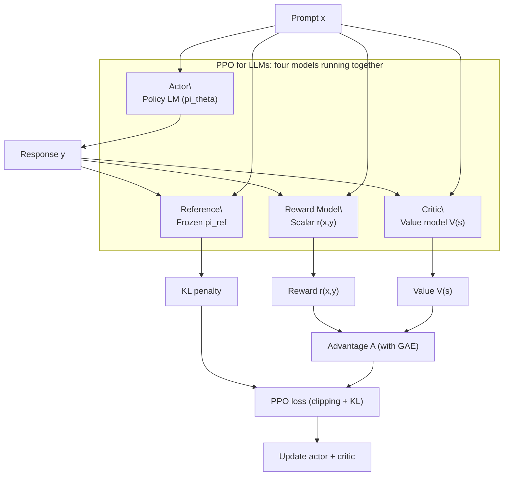

# 7.4 GAE and Reward Models

In the previous section, we dissected PPO's clipping trick: a piece of engineering pragmatism that replaces an explicit KL-constraint with a clipped surrogate objective (review: [Trust Region and Clipping](./trust-region-clipping)). But there is another input in PPO that we have not unpacked carefully yet: the **advantage** term $A_t$.

PPO can only update the policy if you can answer a concrete question:

Which actions were better than what the policy would do on average, and by how much?

That is exactly what **Generalized Advantage Estimation (GAE)** is for. And once PPO is used in LLM alignment, we also need a heavier component: a **reward model (RM)** that turns human preference signals into a scalar reward. This section explains both pieces and how they fit together.

::: tip Prerequisites

- [Advantage function $A(s,a) = Q - V$](../chapter06_actor_critic/advantage-function): what we are trying to estimate
- [TD error $\delta = r + \gamma V(s') - V(s)$](../chapter06_actor_critic/critic-training): the building block behind GAE
- [DP vs MC vs TD](../chapter03_mdp/dp-mc-td): GAE is an interpolation between TD and MC
- [Reward design](../chapter03_mdp/reward-design): RM thinking is close in spirit to reward shaping
  :::

## Advantage Estimation: TD vs MC

Recall the definition (review: [Section 6.1](../chapter06_actor_critic/advantage-function)):

$$A(s_t, a_t) = Q(s_t, a_t) - V(s_t)$$

It means: at state $s_t$, how much better is action $a_t$ compared to the policy's average behavior. The difficulty is that $Q(s_t, a_t)$ is unknown. We cannot read the future; we can only estimate it.

Two classical estimators sit at opposite ends of the bias-variance spectrum:

**Temporal-Difference (TD) estimator** (review: [TD training for the critic](../chapter06_actor_critic/critic-training)). Use one-step bootstrapping:

$$A_t^{\text{TD}} = r_t + \gamma V(s_{t+1}) - V(s_t) = \delta_t$$

TD has low variance (only one step of randomness), but it is biased. If the critic's estimate $V(s_{t+1})$ is inaccurate, the error is injected into the advantage.

**Monte Carlo (MC) estimator** (review: [MC methods](../chapter03_mdp/dp-mc-td)). Wait until the end of the episode:

$$A_t^{\text{MC}} = G_t - V(s_t) = \sum_{k=0}^{\infty} \gamma^k r_{t+k} - V(s_t)$$

MC is unbiased with respect to the return $G_t$, but it has very high variance. Every random event in the remaining trajectory affects the estimate.

In practice, neither extreme is ideal as a default. We want a smooth knob that trades bias for variance.

## GAE: A Controlled Bias-Variance Tradeoff

GAE (Schulman et al., 2016) introduces a parameter $\lambda \in [0,1]$ that interpolates between TD and MC:

$$\hat{A}_t^{\text{GAE}(\gamma, \lambda)} = \sum_{k=0}^{\infty} (\gamma \lambda)^k \delta_{t+k}$$

where the TD error is

$$\delta_t = r_t + \gamma V(s_{t+1}) - V(s_t).$$

This formula is short, but its meaning is concrete:

- If $\lambda = 0$: $\hat{A}_t = \delta_t$ (one-step TD, higher bias, lower variance)
- If $\lambda = 1$: $\hat{A}_t = \sum_{k=0}^{\infty} \gamma^k \delta_{t+k} = G_t - V(s_t)$ (MC-style, lower bias, higher variance)
- If $0 < \lambda < 1$: later TD errors are down-weighted by $(\gamma \lambda)^k$

For example, with $\lambda = 0.95$:

$$\hat{A}_t = \delta_t + 0.95\gamma \cdot \delta_{t+1} + (0.95\gamma)^2 \cdot \delta_{t+2} + (0.95\gamma)^3 \cdot \delta_{t+3} + \cdots$$

The further into the future, the less we trust the credit assignment, so we discount it twice: once by $\gamma$ (task horizon), once by $\lambda$ (estimation horizon).

| $\lambda$ | Roughly equals | Bias   | Variance   | When it tends to work               |
| ---------- | -------------- | ------ | ---------- | ----------------------------------- |
| 0.0        | pure TD        | high   | low        | critic is weak, reward is noisy     |
| 0.9        | TD-leaning     | medium | medium-low | general-purpose                     |
| 0.95       | balanced       | lower  | medium     | **common PPO default**              |
| 0.99       | MC-leaning     | low    | higher     | critic is accurate, fine evaluation |
| 1.0        | pure MC        | lowest | high       | short episodes, plenty of data      |

In many PPO implementations, $\lambda = 0.95$ (or $0.98$) is a robust default.

```python
# ==========================================
# A minimal GAE implementation (from scratch)
# ==========================================
import numpy as np

def compute_gae(rewards, values, dones, gamma=0.99, lam=0.95):
    """
    Compute GAE advantages.

    Args:
        rewards: list/array of r_t
        values: list/array of V(s_t)
        dones: list/array of episode termination flags (1 if done else 0)
        gamma: discount factor
        lam: GAE lambda

    Returns:
        advantages: A_hat_t
        returns: targets for critic training, i.e., advantages + values
    """
    advantages = []
    gae = 0.0

    for t in reversed(range(len(rewards))):
        next_value = 0.0 if (t == len(rewards) - 1) else values[t + 1]
        nonterminal = 1.0 - float(dones[t])

        delta = rewards[t] + gamma * next_value * nonterminal - values[t]
        gae = delta + gamma * lam * nonterminal * gae
        advantages.insert(0, gae)

    advantages = np.array(advantages, dtype=np.float32)
    returns = advantages + np.array(values[: len(rewards)], dtype=np.float32)
    return advantages, returns

# A tiny example episode
rewards = [0.0, 0.0, 0.0, 0.0, 1.0]
values  = [0.1, 0.2, 0.3, 0.5, 0.8]
dones   = [0,   0,   0,   0,   1  ]

advantages, returns = compute_gae(rewards, values, dones)
print("advantages:", advantages)
print("returns:", returns)
```

## Reward Models: Where Does the Reward Come From in LLM Alignment?

In classic RL environments (CartPole, LunarLander), the environment provides the reward: staying upright yields positive reward; crashing yields negative reward. In LLM alignment, the key question is:

Who decides whether an answer is good?

The standard RLHF recipe introduces a reward model $r_\phi(x, y)$ that maps a prompt $x$ and a model response $y$ to a scalar. The RM is trained from **pairwise human preferences**.

### Preference Loss (Bradley-Terry / Logistic)

Suppose we have two answers to the same prompt: a preferred answer $y_w$ (winner) and a less preferred answer $y_l$ (loser). The RM is trained so that $r_\phi(x, y_w) > r_\phi(x, y_l)$. A common loss is:

$$L_{\text{RM}} = -\log \sigma\big(r_\phi(x, y_w) - r_\phi(x, y_l)\big)$$

where $\sigma(\cdot)$ is the sigmoid function. If the score gap is large, the probability of preferring the winner becomes close to 1.

### A Minimal Training Sketch

```python
# ==========================================
# Reward model training sketch (simplified)
# ==========================================
def reward_model_loss(rm, prompt, chosen, rejected):
    """
    rm: reward model, maps (prompt, response) -> scalar score
    """
    r_chosen = rm(prompt, chosen)
    r_rejected = rm(prompt, rejected)
    loss = -torch.log(torch.sigmoid(r_chosen - r_rejected))
    return loss.mean()
```

### Three Practical Pain Points

Training a good RM is one of the most expensive parts of RLHF:

1. **Labeling cost**: you need many preference comparisons, each requiring human time and consistent guidelines.
2. **Reward hacking**: the policy may learn superficial patterns that fool the RM (verbosity, formatting, confident tone) without improving correctness.
3. **Distribution shift**: the RM is trained on data from an earlier policy. After RL updates, the policy's response distribution changes, and RM scores can become less reliable.

## Sparse Reward and Credit Assignment in Token Space

An LLM response can be 500 tokens long. From an RL viewpoint, that is a 500-step sequential decision process. But the RM typically produces a single scalar reward at the end. That is an extreme sparse-reward setting:

500 actions, 1 reward.

The real issue is credit assignment: which tokens actually contributed to the final score?

PPO addresses this by applying policy gradients at the token level. Conceptually:

$$\nabla_\theta L \\propto A_t \cdot \nabla_\theta \log \pi_\theta(a_t | s_t)$$

Tokens that increase the advantage are reinforced; tokens that decrease it are discouraged. In practice, we also add a KL penalty against a reference policy to keep updates from drifting too far.

## The Full PPO-for-LLM Picture

When PPO is used for LLM alignment, you typically run four models together:

- **Actor**: the policy (LM) that generates responses
- **Critic**: a value model that estimates $V(s)$ for advantage computation
- **Reference model**: a frozen baseline used to compute KL penalties
- **Reward model**: the scalar evaluator trained from preferences



This makes the algorithmic story concrete: GAE provides stable advantages; the RM provides a learning signal; PPO ties them together under a trust-region-like update constraint.
